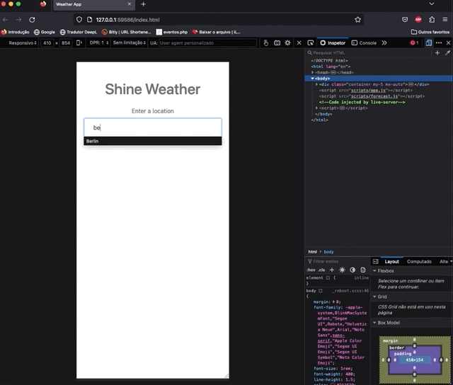

<h1 align="center">☀️Weather App☀️</h1>
<h3 align="center"> App developed as an exercise for Udemy's course to get better practices of API and JavaScript</h3>

##
<h3 align="left">Technologies:</h3>

  - JavaScript 
  - HTML
  - CSS
  - Bootstrap
  - API
    

##
<h3 align="left">About the Website:</h3>

  
  - Interact with AccuWeather API
  - DOM
  - Developed to be an App 

  
  

##
<h3 align="left">Showroom:</h3>

https://github.com/GabiMonteiros/weatherApp

